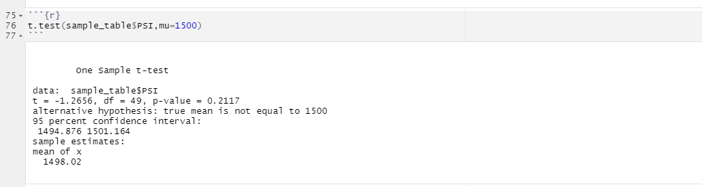

# MechaCar_Statistical_Analysis

## Overview
1-Perform multiple linear regression analysis to identify which variables in the dataset predict the mpg of MechaCar prototypes
2-Collect summary statistics on the pounds per square inch (PSI) of the suspension coils from the manufacturing lots
3-Run t-tests to determine if the manufacturing lots are statistically different from the mean population
4-Design a statistical study to compare vehicle performance of the MechaCar vehicles against vehicles from other manufacturers.  

## Linear Regression to Predict MPG

Which variables/coefficients provided a non-random amount of variance to the mpg values in the dataset?
   Vehicle length and ground clearance factors have the highest impact on predicting mpg and change in any one of these two variables results in a 6.267128 and 3.545534 increase respectively

From the output of the linear model, we see that vehicle length and ground clearance has the highest impact on predicting mpg with very small p-values, a unit change in any one of these two variables results in a 6.267128 and 3.545534 increase in mpg respectively keeping all other factors constant

  Is the slope of the linear model considered to be zero? Why or why not?

  Linear model equation: mpg = 6.26713(vl) + 0.00125(vw) + 0.06877(sa) + 3.54553(gc) - 3.41150(AWD) - 103.96398
  Since all coefficients of predictor varaiables are non-zero, slope of our linear model is non-zero.

Does this linear model predict mpg of MechaCar prototypes effectively? Why or why not?

  R Squared value is 71.49% --> Implies that most of the time predictions will be accurate using the linear model. Very small p-values for vehicle length and ground clearance confirm that our model gives a confirmation most of the time between mpg and the predictor variables

# Summary Statistics on Suspension Coils

The design specifications for the MechaCar suspension coils dictate that the variance of the suspension coils must not exceed 100 pounds per square inch. Does the current manufacturing data meet this design specification for all manufacturing lots in total and each lot individually? Why or why not?

Lot1 and Lot2 variances are within design specification. We however notice that Lot3 has a higher than normal variance at 170.2861224.

## T-Tests on Suspension Coils

Briefly summarize your interpretation and findings for the t-test results

Hypothesis:
Forming our Hypothesis
H0 : There is no statistical difference between the observed sample mean for each lot and it's population mean 1500 PSI.
Ha : There is a statistical difference between the observed sample mean for each lot and it's population mean of 1500 PSI.

Significance level = 0.05 percent and p-value is above significance level. 
We do not have sufficient evidence to reject the null hypothesis and we would state that the two means are statistically similar.

Significance level = 0.05 percent and p-value is above significance level. 
We do not have sufficient evidence to reject the null hypothesis and so we would state that the two means are statistically similar.

Significance level = 0.05 percent and p-value is above significance level. 
We do not have sufficient evidence to reject the null hypothesis and so we would state that the two means are statistically similar.

Significance level = 0.05 percent and p-value is below significance level. 
We have sufficient evidence to reject the null hypothesis and so we would state that the two means are not statistically similar.

## Study Design: MechaCar vs Competition

Since our study design seeks to improve MecharCar against competition, we would look to study metrics such as cost, city or highway fuel efficiency, horse power, maintenance cost, or safety rating.

What metric or metrics are you going to test?
   Are there differences average city or highway fuel effiency between MecharCar vehicles and competition vehicles?

What is the null hypothesis or alternative hypothesis?
  Null Hyothesis: There is no difference between average city or highway fuel efficiency between MecharCar and Competition vehicles
  Alternative Hypothesis: There is difference between average city or highway fuel efficiency between MecharCar and Competition vehicles

What statistical test would you use to test the hypothesis? And why?
  Type of data -Dichotomous (Sample A versus Sample B)
  Dependent Variable- city or highway fuel efficiency---> Continuous
  Based on above data , we would employ Two sample T Test to evaluate if there are differences on fuel efficiency between MechaCar and competition vehicles

What data is needed to run the statistical test?
   To perform the test, we would need data of MechaCar vehicles and its competition, all gathered in a single dataframe where each metric is a column.